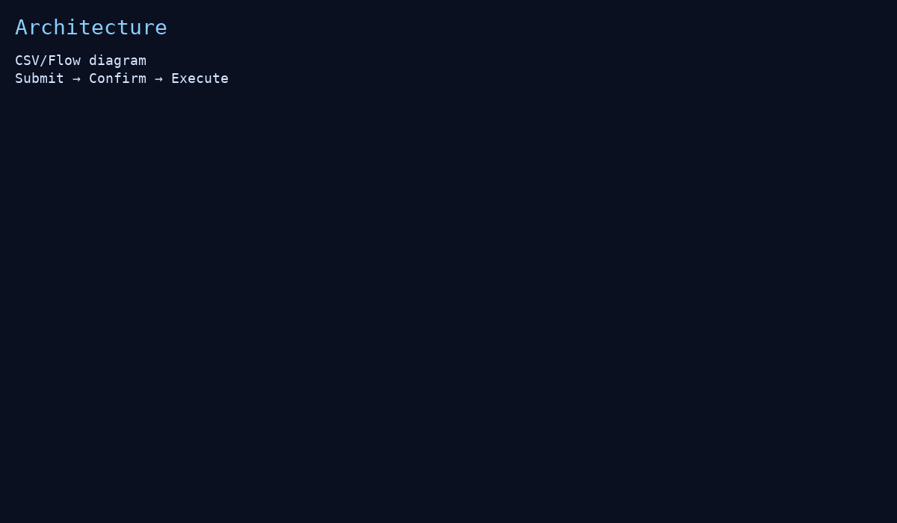
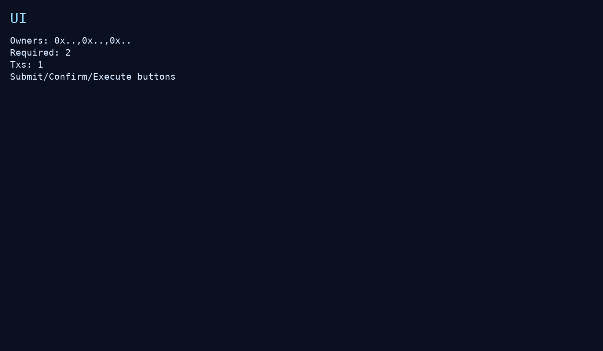
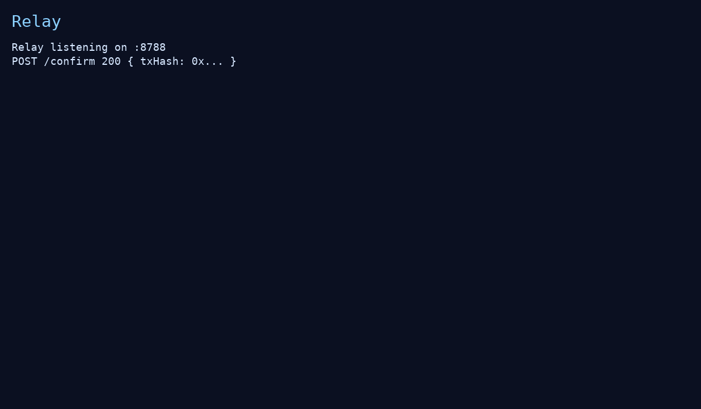
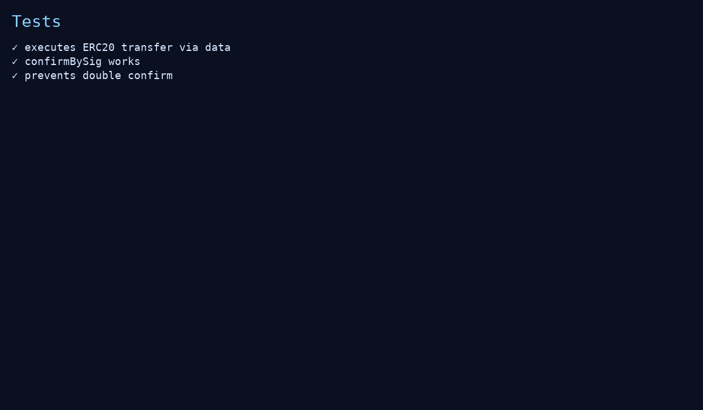
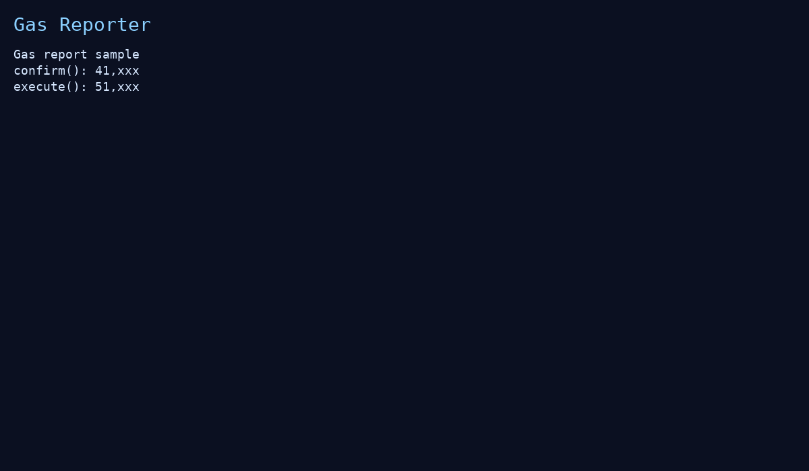

# MultiSig Treasury DApp — Ultimate

Production‑style multisig wallet: on‑chain confirmations + **EIP‑712 meta‑confirm** (relayer pays gas), ERC20/ETH execution via `call`, events/UI/scripts/tests, gas & coverage, and CI‑ready.



## TL;DR
```bash
npm i
npm run node
npm run compile
npm run deploy  # writes frontend/deployment.json
```
Fund the wallet:
```bash
WALLET=<addr> npm run fund
```
Submit ETH tx:
```bash
WALLET=<addr> TO=<recipient> VALUE=0.1 npm run submit:eth
```
Submit ERC20 tx:
```bash
WALLET=<addr> TOKEN=<token> TO=<recipient> AMOUNT=100 npm run submit:erc20
```
Confirm/Execute in UI or CLI:
```bash
WALLET=<addr> TXID=0 npm run execute
```

Open UI:
```bash
npm run serve
# http://localhost:3000
```


## Features
- Owners/threshold, per‑tx confirmations, revoke, auto‑execute on threshold.
- ERC20/ETH support via generic `to/value/data` + `call`.
- **EIP‑712** typed **confirmBySig**: sign `{txId,wallet,txHash,deadline}` and relayer submits.
- Minimal **UI** (ethers UMD): submit/confirm/revoke/execute, meta‑sign + relay.
- Scripts for quick scenarios; **tests**, **gas**, **coverage**; optional relay server.

## Meta‑Confirm (EIP‑712)
Relay server (optional):
```bash
cp .env.example .env  # insert RELAYER_KEY
npm run relay:server  # GET /health
```
In UI: prepare & sign → send to relayer.  


## Tests / Reports
```bash
npm test
REPORT_GAS=true npm run gas
npm run coverage
```
 

## Structure
```
contracts/   MultiSigWallet.sol, MockERC20.sol
scripts/     deploy, fund, submit_eth, submit_erc20, execute
frontend/    index.html + deployment.json
server/      Express relay (confirmBySig)
test/        multisig.test.js
```
Educational demo. Audit before production.
